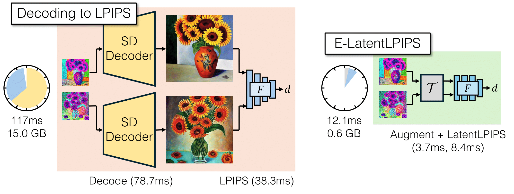
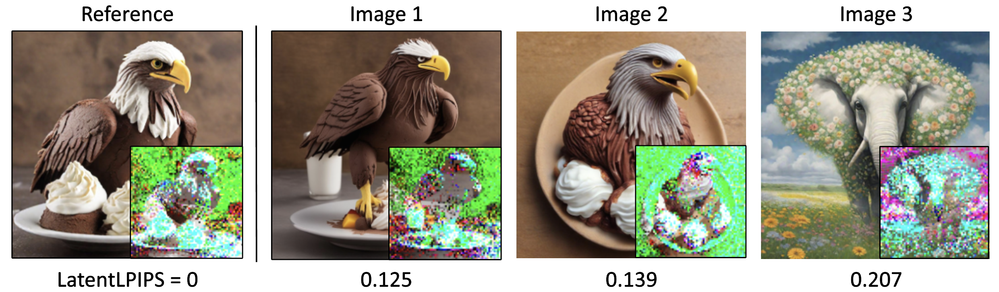
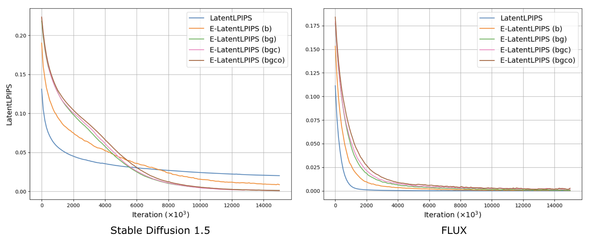

# E-LatentLPIPS [[Project Page]](https://mingukkang.github.io/Diffusion2GAN/)

**Diffusion2GAN: Distilling Diffusion Models into Conditional GANs [(paper)](https://arxiv.org/abs/2405.05967)**

[Minguk Kang](https://mingukkang.github.io/), [Richard Zhang](https://richzhang.github.io/), [Connelly Barnes](https://www.connellybarnes.com/work/), [Sylvain Paris](https://research.adobe.com/person/sylvain-paris/), [Suha Kwak](https://suhakwak.github.io/), [Jaesik Park](https://jaesik.info/), [Eli Shechtman](https://research.adobe.com/person/eli-shechtman/), [Jun-Yan Zhu](https://www.cs.cmu.edu/~junyanz/), [Taesung Park](https://taesung.me/). In [ECCV](https://arxiv.org/abs/2405.05967), 2024.

This repository contains the author’s re-implementation of E-LatentLPIPS from my memory.

# Notice

We found that latentlpips has an issue with Distributed Data Parallel (DDP) training. Specifically, torch.load() creates multiple processes on the main GPU instead of distributing GPU memory across devices. You'll need to update the current elatentlpips if you plan to use it with DDP training.

`pip install elatentlpips --upgrade`


# What is E-LatentLPIPS?

E-LatentLPIPS is a perceptual distance metric that operates directly in the latent space of a Latent Diffusion Model, allowing users to calculate perceptual distances for regression tasks without decoding the latents into pixel space. This bypasses the costly decoding process required by LPIPS, offering a 9.7× speed up and reducing memory usage.






# Models

We provide E-LatentLPIPS for five different Latent Diffusion Models: [SD1.5](https://github.com/runwayml/stable-diffusion), [SD2.1](https://github.com/Stability-AI/stablediffusion), [SDXL](https://github.com/Stability-AI/generative-models), [SD3](https://stability.ai/news/stable-diffusion-3), and [FLUX](https://github.com/black-forest-labs/flux).

- `SD1.5 E-LatentLPIPS` Operates in the 4-channel latent space
- `SD2.1 E-LatentLPIPS` Operates in the 4-channel latent space (identical to SD1.5)
- `SDXL E-LatentLPIPS` Operates in the 4-channel latent space
- `SD3 E-LatentLPIPS` Operates in the 16-channel latent space
- `FLUX E-LatentLPIPS` Operates in the 16-channel latent space

Each model supports the use of E-LatentLPIPS within its specific latent space configuration.​

## Setup

Option 1: Install using pip:

`pip install elatentlpips`

Option 2: Clone our repo and install dependencies.

```
git clone https://github.com/mingukkang/elatentlpips.git
cd elatentlpips
pip install -r requirements.txt
```

## Quick Start

```python
import torch
from diffusers import AutoencoderKL
from elatentlpips import ELatentLPIPS

# Load the VAE encoder and decoder from the FLUX model
# If you want to use the latest FLUX encoder, please ensure that you update your diffusers package to the latest version:
# 'pip install --upgrade diffusers[torch]'
vae = AutoencoderKL.from_pretrained("black-forest-labs/FLUX.1-dev", subfolder="vae").to("cuda")

# Initialize E-LatentLPIPS with the specified encoder model (options: sd15, sd21, sdxl, sd3, flux)
# The 'augment' parameter can be set to one of the following: b, bg, bgc, bgco
elatentlpips = ELatentLPIPS(encoder="flux", augment='bg').to("cuda").eval()

# Generate random images (ensure images are RGB and normalized to the range [-1, 1])
image0 = torch.zeros(1, 3, 512, 512).to("cuda")  # First image (RGB, normalized)
image1 = torch.zeros(1, 3, 512, 512).to("cuda")  # Second image (RGB, normalized)

# Encode the images into the latent space using the VAE
latent0 = vae.encode(image0).latent_dist.sample()  # Encoded latent for image0
latent1 = vae.encode(image1).latent_dist.sample()  # Encoded latent for image1

# Compute the perceptual distance between the two latent representations
# Note: Set `normalize=True` if the latents (latent0 and latent1) are not already normalized 
# by `vae.config.scaling_factor` and `vae.config.shift_factor`.
distance = elatentlpips(latent0, latent1, normalize=True).mean()
```

## Performances

<div align="center">

| **Perceptual Metric**     | **ImageNet Top-1 Acc.** | **BAPPS 2AFC Traditional** | **BAPPS 2AFC CNN** |
|---------------------------|-------------------------|----------------------------|--------------------|
| LPIPS                     | 73.36                   | 73.36                      | 82.20              |
| SD1.5-LatentLPIPS (paper) | 68.26                   | 74.29                      | 81.99              |
| SD1.5-LatentLPIPS         | 69.91                   | 73.68                      | 81.77              |
| SD2.1-LatentLPIPS         | 69.91                   | 73.68                      | 81.77              |
| SDXL-LatentLPIPS          | 68.90                   | 71.33                      | 81.10              |
| SD3-LatentLPIPS           | 71.10                   | 76.15                      | 82.63              |
| FLUX-LatentLPIPS          | 66.18                   | 75.00                      | 82.47              |

</div>

## Overfitting experiment 
We perform overfitting experiments as outlined in Appendix B of the [Diffusion2GAN paper](https://mingukkang.github.io/Diffusion2GAN/static/paper/diffusion2gan_arxiv_v2.pdf). We observed that LatentLPIPS tends to exhibit a more favorable optimization landscape when using larger channel latent space, such as that of SD3 and FLUX.

Command: `CUDA_VISIBLE_DEVICES=0 python3 overfitting_exp.py --encoder sd15` or `flux`



We use the following notations: `b` for pixel blitting, `g` for geometric transformations, `c` for color transformations, and `o` for cutout. Thus, `E-LatentLPIPS (bg)` refers to ensembled LatentLPIPS with pixel blitting and geometric transformations applied as augmentations.


## E-LatentLPIPS thanks the following repos for the code sharing

LPIPS (BSD-2-Clause license): https://github.com/richzhang/PerceptualSimilarity

Differentiable Augmentation (MIT license): https://github.com/mit-han-lab/data-efficient-gans

ADA (NVIDIA source code license): https://github.com/NVlabs/stylegan2-ada-pytorch

## License
E-LatentLPIPS is an open-source library under the [CC-BY-NC license](https://github.com/mingukkang/elatentlpips/blob/main/LICENSE).

## Citation
If you find E-LatentLPIPS useful in your research, please cite our work:
```bib
@inproceedings{kang2024diffusion2gan,
  author    = {Kang, Minguk and Zhang, Richard and Barnes, Connelly and Paris, Sylvain and Kwak, Suha and Park, Jaesik and Shechtman, Eli and Zhu, Jun-Yan and Park, Taesung},
  title     = {{Distilling Diffusion Models into Conditional GANs}},
  booktitle = {European Conference on Computer Vision (ECCV)},
  year      = {2024},
}
```
